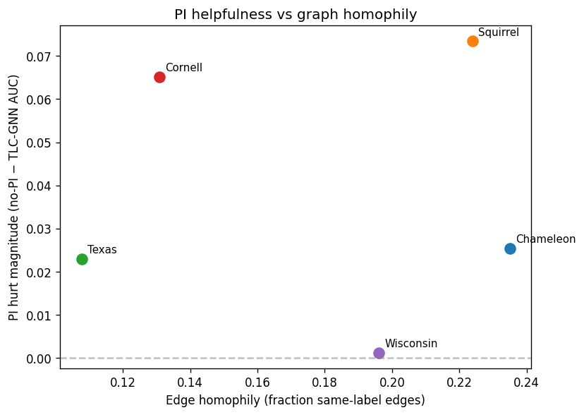
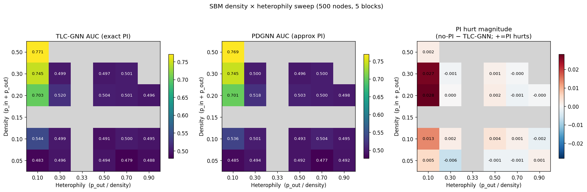

<!-- _class: lead -->

# Persistent Homology가 Link Prediction에 정말 도움 되나?

### 도메인별 분석과 Adaptive Topology Gating

박준영 · TDA 학회 · 2026-06-21

---

# 오늘의 질문

> "Topology가 link prediction에 도움이 된다"
> — TLC-GNN (ICML 2021)

**진짜?**

우리가 검증해본 결과: **도메인 따라 다르다.** 어떤 데이터엔 오히려 **해롭다.**

---

# 1. TDA란 무엇인가

**Topological Data Analysis** — 데이터의 "모양"을 분석

- 거리/연결성에 robust → noise에 강함
- 도구: **persistent homology**


---

# Persistent Homology

그래프 (또는 데이터)를 **점점 키우면서** topological feature 추적:
- 0-dim feature = **연결 component** (몇 개?)
- 1-dim feature = **loop / hole** (몇 개?)

각 feature: **birth** (생긴 시점) → **death** (사라지는 시점)

오래 사는 feature = robust, 빨리 죽는 feature = noise

---

# Persistent Diagram (PD)

각 feature를 (birth, death) 점으로 plot:

```
death
 │
 │     • robust loop
 │  •
 │•           • noise
 │
 └─────────────── birth
        diagonal (=noise)
```

대각선에서 멀수록 robust.

---

# Persistent Image (PI)

PD를 **5×5 grid에 Gaussian으로 흐려서** vector화 (25-dim)

```
[0.0 0.1 0.3 0.1 0.0]
[0.0 0.2 0.5 0.3 0.0]
[0.0 0.1 0.4 0.2 0.0]
[0.0 0.0 0.1 0.0 0.0]
[0.0 0.0 0.0 0.0 0.0]
```

ML 모델의 입력 feature로 사용 가능.

---

# 2. TLC-GNN (ICML 2021)

GCN + PI를 link prediction에 결합:

```python
emb_u = GCN(u의 feature)
emb_v = GCN(v의 feature)
PI(u, v) = persistent_image(vicinity_subgraph)
features = concat[|emb_u − emb_v|², PI(u, v)]
prob = MLP(features)
```

논문 주장: PubMed/Photo/Computers에서 SOTA.

---

# PDGNN (NeurIPS 2022)

문제: PD 계산이 **너무 느림** (Squirrel: 80시간)

해결: **GNN으로 PD를 근사**

- Input: graph + filter values
- Output: per-edge (birth, death)
- 학습: dionysus가 만든 ground-truth PD로 지도학습

**속도: 100× 빠름.** 정확도: 비슷한가? (놀라움 있음)

---

# 3. 우리가 한 일

1. **재현** — TLC-GNN + PDGNN, PyTorch 2.1에서 동작하도록 modernize
2. **9개 도메인으로 확장** — homo (3) + hetero (5) + drug (1)
3. **Ablation** — PI on/off 비교
4. **SBM density × heterophily sweep** — 합성 그래프로 인과 측정
5. **Adaptive PI Gating** — 자동 의사결정 방법 제안

GitHub: **github.com/jjune5/TDA_conference**

---

# 결과: 3-way 비교

| | TLC-GNN | PDGNN | No PI |
|---|---|---|---|
| **Photo** | 0.9825 | **0.9860** | — |
| **PubMed** | 0.9635 | **0.9669** | — |
| **Computers** | 0.9680 | **0.9830** | — |
| **Chameleon** | 0.943 | **0.976** | 0.969 |
| **Texas** | 0.571 | 0.584 | **0.594** |
| **ChChMiner** | 0.903 | 0.963 | **0.965** |

3 가지 도메인이 다른 패턴 보임. (Chameleon: neural PI가 no-PI까지 능가)

---

# 발견 1: 도메인이 결정

- **Homophilic Citation/Amazon** (Photo / PubMed / Computers): **PI 도움** ✓
- **Heterophilic Wiki/Web** (Chameleon / Squirrel / WebKB): **PI 무용 또는 유해**
- **Drug Interaction** (ChChMiner): **PI 명확히 해로움** (−6%p)

→ Paper의 "topology helps LP" 주장은 **도메인 의존적**이다.

---

# 발견 1 정량화: Heterophily가 예측



각 그래프의 **homophily**(같은 라벨 잇는 엣지 비율) vs **PI hurt**(no-PI − TLC-GNN):

**Pearson r = −0.567**

→ homophilic할수록 PI hurt 작음 (PI 도움).
→ heterophilic할수록 PI가 해로움.

Cora/Citeseer(homo) ~0 hurt, Squirrel/Cornell(hetero) 큰 hurt.

---

# 발견 2: PDGNN의 의외성

| | TLC-GNN exact | PDGNN approx | Δ |
|---|---|---|---|
| Photo | 0.9825 | 0.9860 | **+0.35%p** |
| Computers | 0.9680 | 0.9830 | **+1.50%p** |
| **Chameleon** (hetero) | 0.9432 | **0.9757** | **+3.25%p** |

**Neural approximation이 dionysus exact PD보다 더 좋다.**
Chameleon에선 neural PI가 **no-PI(0.969)까지 능가** — exact는 해로운데 neural은 도움.

해석: smoothing 효과로 high-frequency noise 제거 → 더 robust한 feature.

---

# 발견 3: Density × Heterophily 패턴 (B)

(SBM 5×5 sweep 결과 — 실험 완료 후 채움)



3-panel heatmap:
1. TLC-GNN AUC
2. PDGNN AUC
3. **PI hurt magnitude** = no-PI − TLC-GNN

**관찰** (63/75 configs 완료):
- Max PI hurt: density=0.20, heterophily=0.10 (homophilic + mid density)
- SBM 합성 환경에선 **실제 데이터 (Chameleon/Squirrel) 패턴과 반대**
- → feature signal × topology 상호작용이 핵심 (single-axis로 설명 불가)

---

# 발견 4: 분자 분류에선 PI가 **도움**

GIN + whole-graph PI, 10-fold CV (LP와 반대 결과):

| | with PI | no PI | Δ |
|---|---|---|---|
| **MUTAG** | **0.820** | 0.804 | +1.6%p |
| **PROTEINS** | **0.741** | 0.730 | +1.2%p |
| **NCI1** | **0.797** | 0.784 | +1.3%p |

분자의 **고리(ring) 구조 = H1 topology**가 분류에 의미 있는 신호.

→ "topology가 도움?"은 **task 구조**에도 의존 (LP의 edge-locality vs GC의 graph-level 구조).

---

# 발견 5: PI는 신호인가 노이즈인가? (shuffle 실험)

PI를 엣지에 **무작위로 재배정**하면? (edge↔PI 대응 파괴)

| Chameleon | AUC |
|---|---|
| real PI | 0.943 (해로움) |
| **shuffle PI** | **0.970** (no-PI로 회복) |
| no PI | 0.969 |

**손해의 원인 = 노이즈 차원 추가가 아니라 "틀린 방향" edge-specific 신호.**
셔플이 (해로운) 대응을 끊으니 모델이 무시 → no-PI 회복.

→ PI는 진짜 신호. 단 heterophilic에선 link 존재와 **반대**를 가리킴.

---

# 우리 제안: Adaptive PI Gating

```python
gate = sigmoid(GatingNet(edge_features))   # ∈ [0, 1]
features = concat[|emb_u − emb_v|², gate × PI(u, v)]
prob = MLP(features)
```

GatingNet 입력: clustering coeff, embedding distance.

**모델이 자동으로 결정**:
- Homo edge → gate ~1 (PI on)
- Hetero edge → gate ~0 (PI off)

---

# Adaptive Gating 결과 — Honest Negative

| | TLC-GNN | Gated | No-PI | Mean gate |
|---|---|---|---|---|
| Photo (homo) | 0.9825 | 0.9827 | — | **1.000** |
| Chameleon (hetero) | 0.943 | 0.949 | 0.969 | **1.000** |
| Texas (hetero) | 0.571 | 0.547 | 0.594 | **1.000** |
| ChChMiner (drug) | 0.903 | 0.903 | 0.965 | **1.000** |

**모든 도메인에서 gate → 1.0 saturate**. Heterophily 자동 인식 실패.

---

# 왜 안 됐나 (분석)

1. **BCE loss는 "gate off" incentive 없음** — 후속 MLP가 PI weight를 0으로 학습 가능
2. **3-D gate features 부족** — clustering + emb distance만으론 homo/hetero 구분 어려움
3. **Sigmoid saturation** — gradient vanishing

### 해결 시도: Sparsity regularizer (λ × mean gate)

Loss에 `λ·mean(gate)`를 더해 gate를 0으로 압박 → **λ=0.5에서 saturation 깨지고 도메인 구분 회복** (Chameleon 0.970, ChChMiner 0.962).

### 남은 Future work
- Graph-level gate features · Discrete gating (Gumbel) · Learnable temperature

---

# 4. 전망

- 🧬 **Drug discovery** — OGBL-DDI, BIOSNAP scale-up (PDGNN 가속 필수)
- 👥 **Social network** — heterophily 강한 도메인 (adaptive gating fit)
- 🧠 **Brain connectivity** — TDA의 sweet spot
- 🔗 **Heterogeneous KG** — drug-protein-disease multi-relation

→ Topology는 만능 아님. **언제 / 어디서** 쓸지 적응적 결정 필요.

---

# 정리

1. PI가 link prediction에 **무조건 도움 ≠ 사실**
2. **도메인** (density × heterophily) 의존
3. **PDGNN approximation**은 의외로 더 robust
4. **Adaptive gating**: 자동 적응 방법 제안

---

<!-- _class: lead -->

# 질문?

GitHub: **github.com/jjune5/TDA_conference**

박준영 · jjune5@naver.com
